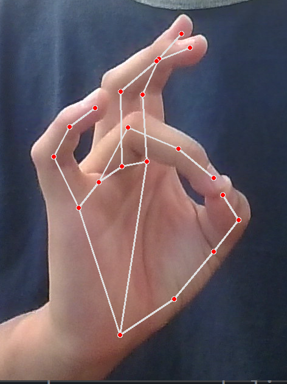

# VirtualMouse

VirtualMouse is a program that lets you control your computer / GUI using only hand gestures.

## Controls

| Control | Picture | Instruction |
| ------- | ------- | ----------- |
| Cursor | 	 | Move the right index finger to control the cursor. |
| Left Click | 	 | Pinch the right hand's middle finger and thumb. |
| Right Click | 	 | Pinch the left hand's middle finger and thumb. | 
| Hold Click |	 |  Press the left hand's thumb down, like pressing a button. Drag the cursor to select content, then lift the left hand's thumb. |
| Scroll |  | Pinch the left hand's index finger and thumb, and drag up / down to scroll up / down. |

## Tools

VirtualMouse was built using OpenCV, Mediapipe, and Pyautogui.

OpenCV is used to open the webcam and process each live video frame. Mediapipe is used to process the image, detect hands, and draw the hand landmarks. Pyautogui is used to execute the necessary commands to the GUI or computer screen.